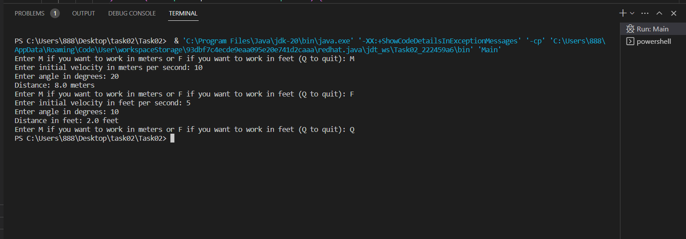
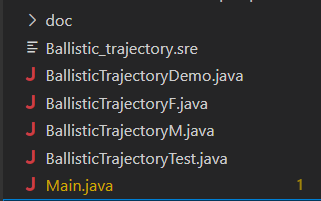
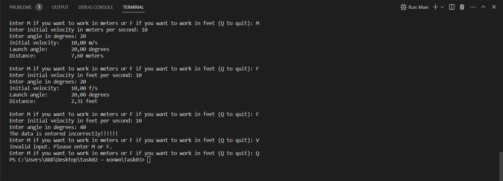
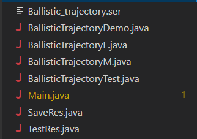

* [Task01](https://github.com/Ivan-blep/34_Tumko_Ivan/edit/main/README.md#task01)
* [Task02](https://github.com/Ivan-blep/34_Tumko_Ivan/edit/main/README.md#task02)
* [Task03](https://github.com/Ivan-blep/34_Tumko_Ivan/edit/main/README.md#task03)
* [Task04](https://github.com/Ivan-blep/34_Tumko_Ivan/edit/main/README.md#task04)

## Task01
#### Завдання:

Виконати розробку найпростішої консольної програми на Java, наприклад,
що виводить на екран усі аргументи командного рядка, задані при запуску
та розмістити її у локальному сховищі:

### Результат виконання:

## Task02
#### Завдання:

Варіант 20. Визначити в англійській та метричній системі заходів значення дальності
польоту (s = v0 * v0 * sin(2 * α) / g) по балістичній траєкторії із заданою
початковою швидкістю v0 та кутом α до поверхні Землі.

### Результат виконання:

Main.java:

BallisticTrajectoryDemo.java:

## Task03
#### Завдання:

1. Як основа використовувати вихідний текст проекту попередньої лабораторної роботи. Забезпечити розміщення результатів обчислень уколекції з можливістю збереження/відновлення.
2. Використовуючи шаблон проектування Factory Method (Virtual Constructor), розробити ієрархію, що передбачає розширення рахунок додавання
нових відображуваних класів.
3. Розширити ієрархію інтерфейсом "фабрикованих" об'єктів, що представляє набір методів для відображення результатів обчислень.
4. Реалізувати ці методи виведення результатів у текстовому виде.
5. Розробити тареалізувати інтерфейс для "фабрикуючого" методу.

### Результат виконання:

Main.java:

Всі класи:

## Task04
#### Завдання:

1.За основу використовувати вихідний текст проекту попередньої лабораторної роботи Використовуючи шаблон проектування Factory Method
(Virtual Constructor), розширити ієрархію похідними класами, реалізують методи для подання результатів у вигляді текстової
таблиці. Параметри відображення таблиці мають визначатися користувачем.
2.Продемонструвати заміщення (перевизначення, overriding), поєднання (перевантаження, overloading), динамічне призначення методів
(Пізнє зв'язування, поліморфізм, dynamic method dispatch).
3. Забезпечити діалоговий інтерфейс із користувачем.
4. Розробити клас для тестування основної функціональності.
5. Використати коментарі для автоматичної генерації документації засобами javadoc.

### Результат виконання:

Main.java:

Всі класи:

